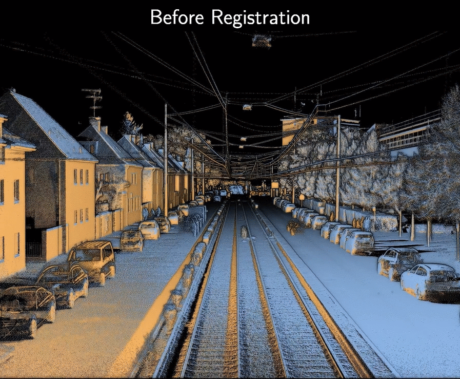

# 3D non-rigid tricubic pointcloud registration

## Introduction

This is an implementation of the method described in the paper "**Non-rigid point cloud registration using piece-wise tricubic polynomials as transformation model**".

This method can be used to register two 3D point clouds which are related by a non-rigid transformation. In other words, when a 6DoF rigid-body transformation (rotation and translation) is insufficient to align the two point clouds, this method might be a suitable alternative.

The following shows the non-rigid registration of two mobile mapping LiDAR point clouds:


(The effect of registration can best be seen on the overhead lines)

The paper can be found [here](https://www.mdpi.com/2072-4292/15/22/5348) - it can be cited as:

```
@article{glira2023a,
  article-number = {5348},
  author         = {Glira, Philipp and Weidinger, Christoph and Otepka-Schremmer, Johannes and Ressl, Camillo and Pfeifer, Norbert and Haberler-Weber, Michaela},
  doi            = {10.3390/rs15225348},
  issn           = {2072-4292},
  journal        = {Remote Sensing},
  number         = {22},
  title          = {Nonrigid Point Cloud Registration Using Piecewise Tricubic Polynomials as Transformation Model},
  url            = {https://www.mdpi.com/2072-4292/15/22/5348},
  volume         = {15},
  year           = {2023}
}
```

## 2D Prototype

A prototype implementation of this algorithm for 2D point clouds written in Matlab can be found [here](https://github.com/AIT-Assistive-Autonomous-Systems/2D_nonrigid_tricubic_pointcloud_registration).

## Development

A predefined development environment for [VSCode](https://code.visualstudio.com) is provided [here](.devcontainer/). To use this environment, simply open this repository in VSCode and:
1. Open the devcontainer with the command ``Dev Containers: Reopen in Container``. This will automatically build the development environment and open it. Then run in the container:
	1. The command ``CMake: Build`` to build all targets.
	2. The command ``Tasks: Run task`` to run the tests.

## Star History

[](https://www.star-history.com/#AIT-Assistive-Autonomous-Systems/3D_nonrigid_tricubic_pointcloud_registration&Date)